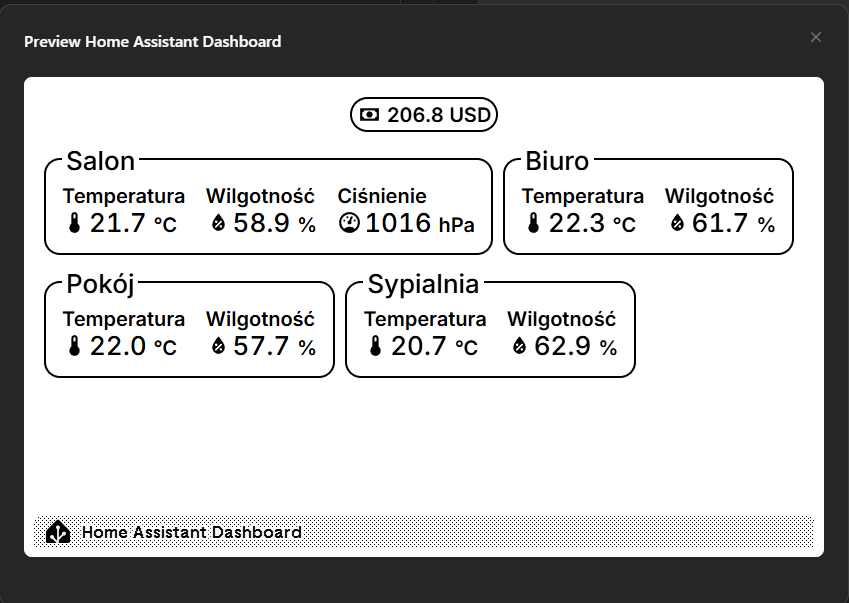
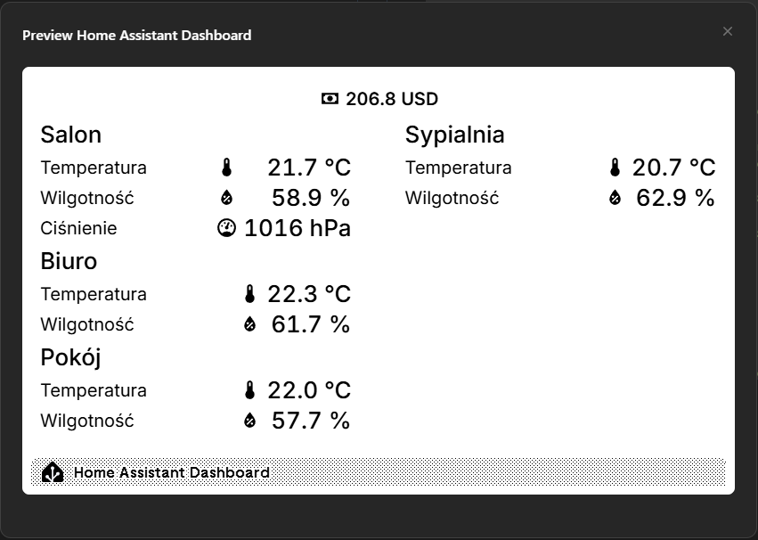
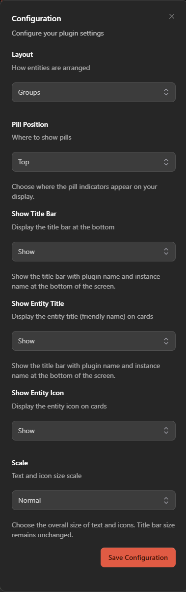
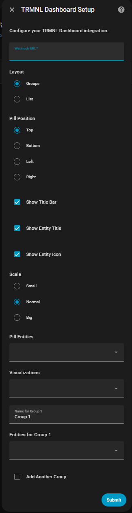

# Home Assistant Dashboard Plugin for TRMNL

A TRMNL plugin for Home Assistant that displays your smart home entities on a TRMNL device. Home Assistant sends entity data to TRMNL via a webhook.

---

## Features

- 🏠 Display any Home Assistant entity (sensors, switches, lights, etc.)
- 🎨 Customizable dashboard with configurable icons, titles, layout types, and scale sizes
- 🧩 Dynamic entity grouping and layout via UI
- 🌐 Multi-language support for HACS integration
- ⚡ Real-time updates via webhook from Home Assistant

## Screenshots (Default settings for Grid and List layouts)

---

## Prerequisites

Before setting up this plugin, ensure you have:

1. **Home Assistant** running and accessible
2. **TRMNL device** set up and connected
3. **Network connectivity** between TRMNL and Home Assistant

## Setup Instructions

### Step 1: Install the Plugin

#### HACS (Recommended)
1. Add this repository to HACS as a custom repository (type: Integration)
2. Install via HACS
3. Restart Home Assistant

#### Manual Installation
1. Copy the `trmnl_dashboard` folder to your Home Assistant `custom_components` directory
2. Restart Home Assistant

### Step 2: Add and Configure the Integration

1. Go to **Settings > Devices & Services** in Home Assistant
2. Click **Add Integration** and search for `TRMNL Dashboard`
3. Use the UI to group entities, set labels, and customize your dashboard

## How It Works

- Home Assistant sends entity data to your TRMNL device using a webhook.
- This plugin receives the data and displays it on the TRMNL screen.
- No control or commands are sent from TRMNL to Home Assistant.
- The integration is display-only: you cannot trigger automations or change entity states from TRMNL.

---

## Configuration Screenshots
### Plugin configuration

### HACS configuration

## Troubleshooting

**Dashboard not displaying:**
- Restart Home Assistant
- Check logs for errors related to `trmnl_dashboard`
- Verify integration is listed under **Settings > Devices & Services**

## Contributing
We welcome contributions! Please:
- Report bugs or issues
- Suggest new features
- Submit pull requests
- Improve documentation

## License
This project is licensed under the MIT License - see the [LICENSE](LICENSE) file for details.

## Author

Created by **pwojtaszko** - A TRMNL plugin for seamless Home Assistant integration.

## Support

For support, please:
1. Check the troubleshooting section above
2. Search existing GitHub issues
3. Create a new issue with details about your setup

---

*This plugin only displays data sent from Home Assistant to TRMNL via webhook. No entity control is possible from TRMNL.*
