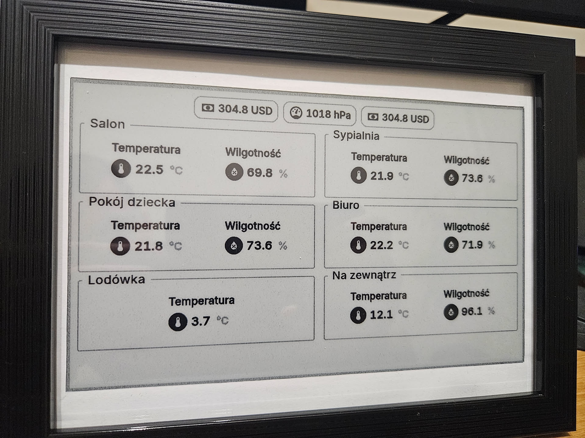

# Home Assistant Entities Plugin for TRMNL

[](LICENSE)

## ⚠️ Deprecation Notice

This plugin is deprecated and no longer maintained. Please refer to the new solution in the workspace.

A comprehensive TRMNL plugin that displays Home Assistant entities with customizable layouts and styles. Monitor your smart home devices, sensors, and controls directly on your TRMNL display.

## Features

- 🏠 Display any Home Assistant entity (sensors, switches, lights, etc.)
- 🎨 Multiple display styles (Simple, Medium, Detailed)
- 📱 Compact pill view for binary sensors and switches  
- 🔧 Flexible layout options (Sections, Free Flow)
- 📍 Customizable pill positioning (Top, Bottom, Left, Right)
- 🔤 Adjustable text scaling for different display sizes
- 🏷️ Smart entity grouping with custom labels
- 🎯 Real-time polling with automatic updates
- 🔒 Secure authentication with Home Assistant tokens

## Screenshots

### Plugin in Action



*Home Assistant entities displayed on TRMNL device*

### Configuration Interface  


*Plugin settings in TRMNL dashboard*


## Prerequisites

Before setting up this plugin, ensure you have:

1. **Home Assistant** running and accessible via HTTP/HTTPS
2. **TRMNL device** set up and connected
3. **Long-lived access token** from Home Assistant
4. **Network connectivity** between TRMNL and Home Assistant

## Setup Instructions

### Step 1: Get Home Assistant Access Token

1. Log into your Home Assistant web interface
2. Go to your **Profile** (click your username in the bottom left)
3. Scroll down to **Long-Lived Access Tokens**
4. Click **Create Token**
5. Give it a name like "TRMNL Plugin"
6. **Copy the token** - you won't see it again!

### Step 2: Install the Plugin

1. Download the plugin files from this repository
2. In your TRMNL dashboard, go to **Plugins**
3. Click **Upload Plugin**
4. Upload the `HomeAssistantEntities.zip` file
5. The plugin will appear in your available plugins list

### Step 3: Configure the Plugin

#### Basic Configuration

1. **HA Server URL**: Enter your Home Assistant base URL
   ```
   Examples:
   https://homeassistant.local:8123
   https://192.168.1.100:8123
   https://your-domain.duckdns.org
   ```

2. **HA Long-lived Token**: Paste the token you created in Step 1

3. **Entities**: Add your entities with labels (one per line)
   ```
   Format: Label:entity_id
   Examples:
   Living Room Temp:sensor.living_room_temperature
   Front Door:binary_sensor.front_door
   Kitchen Light:light.kitchen_main
   ```

#### Display Options

- **Entity Style**: Choose how entities appear
  - `Simple`: Compact cards with icon and value
  - `Medium`: Slightly larger cards with icon, label and value
  - `Detailed`: Larger cards with entity last update date

- **Layout**: Control entity arrangement
  - `Sections`: Organized sections with labels (2 per row)
  - `Free Flow`: Natural wrapping without rigid sections (Can fit more entities)

- **Text Scale**: Adjust overall text size
  - `Small`: Small size
  - `Normal`: 1.25x larger
  - `Large`: 1.5x larger

#### Pill Entities (Optional)

For compact status indicators:

1. **Pill Entities**: Add entity IDs (one per line, no labels needed)
   ```
   Examples:
   binary_sensor.motion_detector
   switch.porch_light
   binary_sensor.garage_door
   ```

2. **Pill Position**: Choose where pills appear
   - `Top`: Above main content
   - `Bottom`: Below main content  
   - `Left`: Vertical strip on left
   - `Right`: Vertical strip on right

### Step 4: Test Your Setup

1. Save your configuration
2. The plugin will start polling Home Assistant
3. Check that entities display correctly
4. Verify data updates every minute (default refresh interval)

## Configuration Examples

### Example 1: Basic Temperature and Light Monitoring
```
Entities:
Living Room:sensor.living_room_temperature
Bedroom:sensor.bedroom_temperature
Kitchen Light:light.kitchen_main

Entity Style: Simple
Layout: Sections
```

### Example 2: Comprehensive Home Status
```
Entities:
Climate:sensor.thermostat_temperature
Climate:sensor.thermostat_humidity
Security:binary_sensor.front_door
Security:binary_sensor.back_door
Lights:light.living_room
Lights:light.bedroom

Pill Entities:
binary_sensor.motion_living_room
binary_sensor.motion_kitchen
switch.porch_light

Entity Style: Detailed
Layout: Sections
Pill Position: Top
```

### Example 3: Compact Dashboard
```
Entities:
Status:sensor.home_temperature
Status:binary_sensor.security_system

Pill Entities:
binary_sensor.door_main
binary_sensor.window_living
switch.outdoor_lights
switch.garage_door

Entity Style: Simple
Layout: Free Flow
Pill Position: Left
Text Scale: Large
```

## Supported Entity Types

The plugin works with most Home Assistant entity types.

If some is not supported, let me know so we can try adding it:

- **Sensors**: `sensor.*` - Temperature, humidity, energy, etc.
- **Binary Sensors**: `binary_sensor.*` - Motion, doors, windows
- **Switches**: `switch.*` - Smart plugs, relays
- **Lights**: `light.*` - Smart bulbs, strips
- **Climate**: `climate.*` - Thermostats, HVAC
- **Covers**: `cover.*` - Blinds, garage doors
- **Locks**: `lock.*` - Smart locks
- **Media Players**: `media_player.*` - Speakers, TVs
- **And more**: The plugin adapts to display any entity with state and attributes

## Troubleshooting

### Common Issues

**Entities not displaying:**
- Verify Home Assistant URL is correct and accessible
- Check that the long-lived token is valid
- Ensure entity IDs exist and are spelled correctly
- Confirm TRMNL can reach your Home Assistant instance

**Authentication errors:**
- Generate a new long-lived access token
- Verify the token was copied completely (no extra spaces)

**Network connectivity:**
- Test Home Assistant URL in a browser from the same network
- Check firewall settings
- For external access, verify port forwarding or VPN setup

**Display issues:**
- Try different entity styles and layouts
- Adjust text scale for your display size
- Check entity labels don't contain special characters

### Debug Tips

1. **Test API access manually:**
   ```bash
   curl -H "Authorization: Bearer YOUR_TOKEN" \
        "https://your-ha-url:8123/api/states/sensor.your_entity"
   ```

2. **Check Home Assistant logs:**
   - Look for API access attempts
   - Verify authentication is working

3. **Verify entity IDs:**
   - Go to Home Assistant Developer Tools → States
   - Find exact entity ID spellings

## Advanced Configuration

### Customizing Entity Labels

You can change how entities appear on your TRMNL display by modifying their **friendly names** in Home Assistant:

1. Go to **Settings** → **Devices & Services** → **Entities**
2. Find your entity and click on it
3. Click the **Settings** (gear) icon
4. Change the **Name** field to your desired label
5. The plugin will use this friendly name in the display

**Example:**
- Entity ID: `sensor.living_room_temperature` 
- Default name: "Living room temperature"
- Custom name: "Temperature" ← This will appear on TRMNL

**Note:** Changes to friendly names in Home Assistant will automatically appear in your TRMNL display on the next refresh.

### Custom Icons

The plugin uses Material Design Icons (MDI). Entity icons are automatically selected based on:
1. Entity's configured icon
2. Device class
3. Domain type
4. Fallback default

### Refresh Rate

The plugin polls Home Assistant every minute by default. This is configured in the `settings.yml` file and optimized for TRMNL's display refresh capabilities.

### Entity Limits

- **Regular entities**: Up to 30 entities with labels
- **Pill entities**: Up to 5 compact status indicators

## Contributing

We welcome contributions! Please feel free to:

- Report bugs or issues
- Suggest new features
- Submit pull requests
- Improve documentation

## License

This project is licensed under the MIT License - see the [LICENSE](LICENSE) file for details.

## Author

Created by **pwojtaszko** - A TRMNL plugin for seamless Home Assistant integration.

## Support

For support, please:
1. Check the troubleshooting section above
2. Search existing GitHub issues
3. Create a new issue with detailed information about your setup

---

*This plugin works with any Home Assistant instance that has the REST API enabled.*
